# ZICK — Entity Relationship Diagram (Corrected)

Changes from the original draft are called out in the notes below the diagram.

```mermaid
erDiagram
    USERS {
        uuid id PK
        string name
        string email UK
        string password_hash "Nullable for OAuth"
        string location
        string avatar_url
        string auth_provider "ENUM: EMAIL, GOOGLE, APPLE"
        string theme_preference "ENUM: IVORY, NAVY"
        string language_preference "e.g. en, fr, es, pt"
        boolean is_premium
        timestamp terms_accepted_at
        timestamp deleted_at "Nullable, soft-delete for GDPR grace period"
        timestamp created_at
        timestamp updated_at
    }

    DEVICE_TOKENS {
        uuid id PK
        uuid user_id FK
        string token
        string platform "ENUM: IOS, ANDROID"
        timestamp created_at
        timestamp last_seen_at
    }

    REFRESH_TOKENS {
        uuid id PK
        uuid user_id FK
        string token_hash
        timestamp expires_at
        timestamp revoked_at "Nullable"
        timestamp created_at
    }

    OTPS {
        uuid id PK
        uuid user_id FK "Nullable until verified against an existing user"
        string email
        string code "5 digits, matches Verify OTP screen"
        string purpose "ENUM: PASSWORD_RESET"
        timestamp expires_at
        boolean is_used
        timestamp created_at
    }

    USER_SCHEDULES {
        uuid id PK
        uuid user_id FK
        time morning_prayer_time
        time night_prayer_time
        string timezone "IANA tz, e.g. Asia/Dhaka"
        boolean push_enabled
        timestamp updated_at
    }

    SUBSCRIPTION_PLANS {
        uuid id PK
        string code "ENUM: BIANNUAL, ANNUAL, FAMILY"
        string name
        numeric price_amount
        string currency
        string billing_interval "ENUM: MONTH, YEAR"
        boolean is_active
        timestamp created_at
    }

    SUBSCRIPTIONS {
        uuid id PK
        uuid user_id FK
        uuid plan_id FK
        string store "ENUM: APPLE, GOOGLE"
        string status "ENUM: ACTIVE, CANCELED, PAST_DUE, EXPIRED"
        string external_transaction_id
        timestamp start_date
        timestamp expires_at
        timestamp created_at
        timestamp updated_at
    }

    CONTENT {
        uuid id PK
        string type "ENUM: PRAYER, MOTIVATION, WORSHIP, PROVERB, DAILY_QUOTE, ILLUSTRATION, ENCOURAGEMENT"
        string sub_type "Nullable: Morning/Night, Day/Night, Prayers/Faith"
        string category_tag "Nullable: Thanksgiving, Consecration, Intercession..."
        string title
        string author_or_speaker "Nullable"
        text body_text "Nullable: scripture/prayer text/description"
        string media_url "Nullable"
        string media_type "ENUM: AUDIO, VIDEO, NONE"
        integer duration_seconds "Nullable"
        string thumbnail_url "Nullable"
        boolean is_premium
        timestamp published_at
        timestamp created_at
        timestamp updated_at
    }

    CONTENT_AUDIENCES {
        uuid content_id FK
        string audience "ENUM: ALL, KIDS, TEENS"
    }

    RELATED_CONTENT {
        uuid primary_content_id FK
        uuid related_content_id FK
    }

    USERS ||--o| USER_SCHEDULES : "has"
    USERS ||--o{ DEVICE_TOKENS : "registers"
    USERS ||--o{ REFRESH_TOKENS : "issues"
    USERS ||--o{ SUBSCRIPTIONS : "has"
    USERS ||--o{ OTPS : "requests"
    SUBSCRIPTION_PLANS ||--o{ SUBSCRIPTIONS : "priced by"
    CONTENT ||--o{ CONTENT_AUDIENCES : "tagged for"
    CONTENT ||--o{ RELATED_CONTENT : "has related"
```



## What changed vs. the original draft, and why

| Change | Reason |
|---|---|
| Added `DEVICE_TOKENS` | SRS requires FCM/APNS push; original ERD had no place to store per-device tokens. Users have multiple devices. |
| Added `REFRESH_TOKENS` | JWT + explicit "Log Out" UI means you need server-side revocation, not just stateless access tokens. |
| `OTPS.code` → 5 chars | Verify OTP screen shows 5 input boxes, not 4. |
| `OTPS` gets `user_id` FK | Raw email string loses referential integrity; keep email for audit but join through `user_id`. |
| Added `SUBSCRIPTION_PLANS` | Plan pricing/features shown in UI ($4.99, $39.99, $79.99) are admin-managed data, not hardcoded enum values. |
| `SUBSCRIPTIONS` gets `plan_id` FK + `store` | Need to distinguish Apple vs Google receipts for validation/webhook routing. |
| `CONTENT` gets `sub_type` | Prayer (Morning/Night), Worship (Day/Night), Kids/Teens (Prayers/Faith) are a second tab dimension the original single `type` field couldn't hold alongside `category_tag`. |
| `description_or_text` → `body_text` | Naming clarity — this field holds scripture, prayer text, and article body, not just "description." |
| Added `CONTENT_AUDIENCES` (M:N) | Kids and Teens screens show *identical* content items across both audiences. A single `type=KIDS` enum can't represent that — needs a join table. |
| Added `terms_accepted_at`, `deleted_at` on `USERS` | T&C checkbox at registration; soft-delete supports a GDPR grace period before hard purge. |

## Indexing plan

```sql
CREATE INDEX idx_content_type ON content(type);
CREATE INDEX idx_content_type_subtype ON content(type, sub_type);
CREATE INDEX idx_content_published_at ON content(published_at DESC);
CREATE INDEX idx_content_is_premium ON content(is_premium);
CREATE INDEX idx_content_audiences_audience ON content_audiences(audience);
CREATE INDEX idx_schedules_morning_time ON user_schedules(morning_prayer_time);
CREATE INDEX idx_schedules_night_time ON user_schedules(night_prayer_time);
CREATE INDEX idx_device_tokens_user ON device_tokens(user_id);
CREATE INDEX idx_subscriptions_user_status ON subscriptions(user_id, status);

-- Full-text search for Library search bar
ALTER TABLE content ADD COLUMN search_vector tsvector
  GENERATED ALWAYS AS (to_tsvector('english', coalesce(title,'') || ' ' || coalesce(body_text,''))) STORED;
CREATE INDEX idx_content_search ON content USING GIN(search_vector);
```
